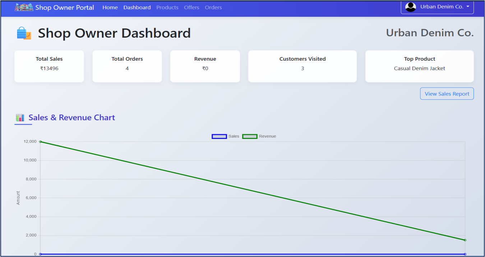

# SuperMall

## Project Overview

SuperMall is a modern web-based e-commerce platform designed to provide a seamless shopping experience. It features a Single Page Application (SPA) frontend, a Node.js backend, and Firebase as the primary database and hosting solution. The platform integrates payment processing via Razorpay and includes an AI assistant powered by Dialogflow for conversational interactions.

## Technology Stack

- **Backend:** Node.js with Express framework
- **Frontend:** JavaScript SPA using Firebase SDK v9 (modular)
- **Database:** Firebase Firestore (NoSQL document database)
- **Hosting:** Firebase Hosting serving the SPA and static assets
- **Payment Gateway:** Razorpay integration for secure payment processing
- **File Uploads:** Multer middleware for handling image uploads
- **API Documentation:** Swagger (OpenAPI) for backend API docs
- **Authentication:** Firebase Authentication
- **AI Assistant:** Dialogflow integration for chatbot functionality

## Features

- User registration, login, and profile management
- Shop owner registration and shop/product management
- Admin dashboard for shop approvals, floor assignments, and issue management
- Browsing shops and products with dynamic filtering
- Shopping cart management and order placement
- Secure payment processing with Razorpay
- Conversational AI assistant for users, shop owners, and admins
- File uploads for shop, product, and profile images
- API documentation accessible via Swagger UI

## Architecture and Data Flow

### Backend

- Express server running on port 5001
- Middleware for CORS, rate limiting, request logging, and JSON parsing
- Multer for handling image uploads with daily cleanup of old files
- Razorpay integration for payment order creation
- Dialogflow API endpoint for chatbot interactions
- Static file serving for frontend assets and uploaded images
- Swagger UI for API documentation

### Frontend

- SPA built with JavaScript and Firebase SDK
- Modules for authentication, shop browsing, cart, orders, payments, and admin reports
- Responsive UI using Bootstrap
- Direct communication with Firestore for data operations
- Payment flow involving backend API calls and Razorpay checkout UI

#### Screenshots

##### Login & Registration


##### Home Page


##### Shop Browsing


##### Shopping Cart


##### Razor pay Payment


##### Shop-Owner Dashboard


##### Admin Dashboard


### Database

- Firebase Firestore collections:
  - `users`: User profiles with role-based access
  - `shops`: Shop details managed by shop owners
  - `products`: Products linked to shops
  - `orders`: User orders with status tracking
  - `carts`: Subcollections under users for cart items
  - `transactions`: Payment transactions linked to orders
  - `offers`: Promotional offers managed by shop owners and admins

- Role-based security rules enforced in Firestore

### AI Assistant

- Dialogflow intents and entities for user, shop owner, and admin tasks
- Backend API mediates communication with Dialogflow agent
- Frontend chat UI component for conversational interactions

## User Roles and Permissions

- **User:** Browse shops/products, manage cart, place orders, submit reviews, interact with AI assistant
- **Shop Owner:** Manage shops, products, offers, view sales and orders, interact with AI assistant
- **Admin:** Approve shops, assign floors, manage issues, oversee platform, interact with AI assistant

## Setup and Installation

1. Clone the repository
2. Install backend dependencies:
   ```bash
   npm install
   ```
3. Configure Firebase project:
   - Create a Firebase project at [Firebase Console](https://console.firebase.google.com/)
   - Enable Firestore database and Firebase Authentication
   - Set up Firestore security rules as per `firestore.rules` file
   - Set up Firestore indexes as per `firestore.indexes.json` file
4. Obtain Firebase service account credentials:
   - In Firebase Console, go to Project Settings > Service Accounts
   - Generate a new private key and download the JSON file
   - Save this file as `credentials.json` in the root of the project directory
5. Configure Dialogflow:
   - Create a Dialogflow agent at [Dialogflow Console](https://dialogflow.cloud.google.com/)
   - Create a Google Cloud service account with Dialogflow API access
   - Generate and download the service account JSON key file
   - Replace the `credentials.json` file with this Dialogflow service account JSON or merge credentials as needed
   - Update the `projectId` in `server.js` to match your Dialogflow project ID
6. Set up Firebase Hosting for frontend or use `firebase serve` for local frontend development
7. Run the backend server:
   ```bash
   node server.js
   ```
8. Access the frontend via Firebase Hosting URL or local server

## Usage

- Register as a user, shop owner, or admin
- Use the frontend SPA to browse shops, manage products, place orders, and more
- Use the AI assistant chat for guided interactions
- Admins can manage shops and platform settings via the admin dashboard

## API Documentation

- Available at `/api-docs` endpoint on the backend server
- Provides detailed information on available API routes and usage


## License

This project is licensed under the MIT License.

## Contact

For questions or support, please contact the project maintainer.

---
